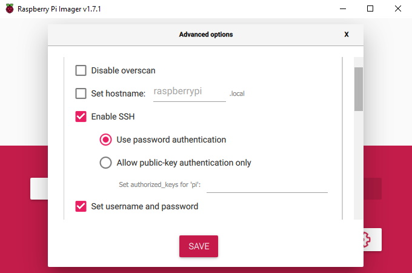
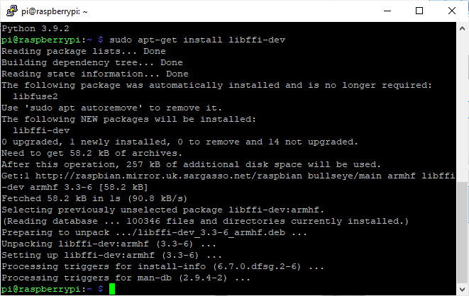
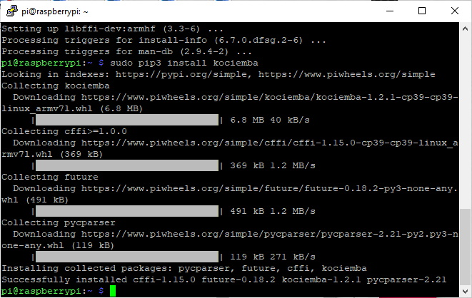

# rasppi-cubesolver
A Raspberry Pi Rubik's cube solver 

## Based on:
- (Hardware) https://www.thingiverse.com/thing:3826740
- (Software) https://github.com/DrVoHo/Rubik_solver

Modifications required to both. I found that the horns did not fit my 995 servos, and the software needed to be adjusted to use a servo controller.


## Build Instructions

1.) Create a fresh install of Raspberry OS
- Use Raspberry Pi imager (https://www.raspberrypi.org/software/) to download and install latest Raspberry OS on an SD card.
- Using the cog icon, you can configure some settings which will save time in the next step - set the default username and password, enable SSH, set locale etc. I recommend enabling SSH at this stage, as that will allow you to remotely connect via Putty to configure the next steps, otherwise you will have to connect a monitor and copmuter keyboard to continue.



- After installing the OS, place the SD card into the Raspberry Pi, and give it a few minutes to first boot up. If you enabled SSH, you can connect remotely via Putty to its IP address (or raspberrypi.local if you enabled the hostname). Otherwise, connect a screen and keyboard. The default credentials are pi/raspberry
- sudo raspi-config
- In interface options, Enable SSH (if not previously enabled in the imager), I2C, and (Legacy) Camera.
- Save and allow the RaspPi to reboot itself

2.) Upgrade to Python3 (if required)
```
python --version
```
*If* version number is Python 2.7.xx, then update reference to Python3 as follows:
```
nano ~/.bashrc
```
Scroll down to the bottom of the file and add the following line:
```
alias python='/usr/bin/python3'
```
Save and Exit. Then execute the amended file
```
source ~/.bashrc
python --version
```
(should now show Python 3.7.xx)

3.) Install Kociemba
```
sudo apt-get install libffi-dev
sudo pip3 install kociemba
```

|lib-ffi-dev|kociemba|
|---|---|
|||

4.) Install Luma
```
sudo pip3 install luma.oled
```

5.) Install PCA9685 Driver
```
sudo pip3 install adafruit-pca9685
```

6.) Use FileZilla to copy over python files to Raspberry Pi. 
- Use SFTP (SSH File Transfer Protocol) to connect, and the same credentials as used for Putty (pi/raspberry)
- Copy button.py and rubik.py to the /home/pi/ directory.
- Also copy over the font file, VCR_OSD_MONO_1.001.ttf (from https://www.dafont.com/vcr-osd-mono.font) to the /home/pi/ directory (you can place it somewhere else, but will need to edit the path in rubik.py appropriately)


7.) Auto-start
- To start script on boot modify /etc/rc.local 
```
sudo nano /etc/rc.local
```
- Insert following line just before 'exit 0'
```
sudo -H -u pi python3 /home/pi/rubic.py &
```

## Operation

- The script creates a /Cube folder, into which it places scanned images of all 6 faces
- 

